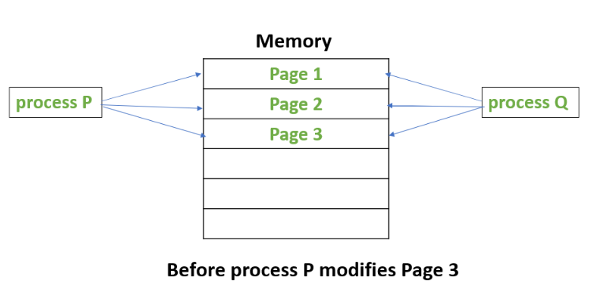

### Copy On Write

Nothing particular happens. All processes are sharing the same set of pages and each one gets its own private copy when it wants to modify a page.

### Copy on Write

Last Updated: 15-05-2020

**Copy on Write** or simply COW is a resource management technique. One of its main use is in the implementation of the fork system call in which it shares the virtual memory(pages) of the OS.

In UNIX like OS, fork() system call creates a duplicate process of the parent process which is called as the child process.

The idea behind a copy-on-write is that when a parent process creates a child process then both of these processes initially will share the same pages in memory and these shared pages will be marked as copy-on-write which means that if any of these processes will try to modify the shared pages then only a copy of these pages will be created and the modifications will be done on the copy of pages by that process and thus not affecting the other process.

Suppose, there is a process P that creates a new process Q and then process P modifies page 3.
The below figures shows what happens before and after process P modifies page 3.

Attention reader! Don’t stop learning now. Get hold of all the important CS Theory concepts for SDE interviews with the [CS Theory Course](https://practice.geeksforgeeks.org/courses/SDE-theory?vC=1) at a student-friendly price and become industry ready.

https://www.geeksforgeeks.org/copy-on-write/#:~:text=Copy%20on%20Write%20or%20simply%20COW%20is%20a,process%20which%20is%20called%20as%20the%20child%20process.

https://unix.stackexchange.com/questions/58145/how-does-copy-on-write-in-fork-handle-multiple-fork