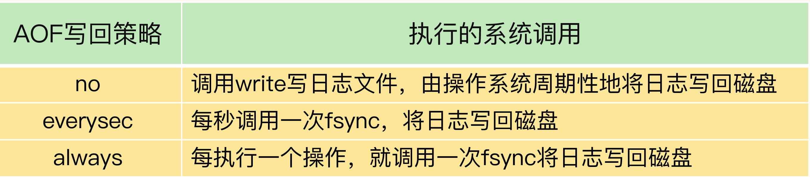

### Redis Latency

> 所谓的redis变慢，通常是指业务层感知到了redis的响应速度变慢了。
>
> 而和redis的响应速度直接相关的，就是redis的主线程了，他负责处理全部的客户端网络请求，并且返回响应。
>
> 所以redis变慢的分析点就是redis的主线程为什么变慢了


如果判断redis是否变慢了

Redis 被部署在各种不同的环境下，物理机，虚拟机，容器等等。不同的环境下的资源不一样，导致redis的基准性能自然也不一样。

首先要获得redis的基准测试情况(redis在最好情况下的表现)

```
redis-cli --intrinsic-latency 100
```

其次要获取redis当前的延迟情况

```
redis-cli --latency -h `host` -p `port`
```


导致redis可能变慢的原因


- 慢查询命令。keys* 不同的操作的时间复杂度不同

- CPU资源不足。后台子进程和主线程同时跑在一个CPU核上，导致CPU争抢

- 网络拥塞。当前的网络环境很差

- 磁盘。当前的磁盘io很高

- bigkey问题。

- 内存占用太大。fork花费时间太长(内存页表的拷贝需要时间)

- 内存占用过大，导致swap产生。

    - 扩展机器的物理内存，同时关闭swap
    - 本机器只允许redis，消耗内存的其他服务统统迁出
    - 使用redis cluster 集群模式，横向扩展

- 日志写回策略不合理。appendfsync:always 每个命令都要同步写磁盘

    - ```
        no-appendfsync-on-rewrite yes
        ```

    - 采用高速的固态硬盘作为 AOF 日志的写入设备

- 大量key在同一时间过期(ACTIVE_EXPIRE_CYCLE_LOOKUPS_PER_LOOP=25%)。redis的主线程每隔100ms处理一次过期key，处理完之后会检查过期的key是否超过25%，如果超过，继续处理，导致长时间阻塞其他请求。

- 操作系统开启了透明大页(transparent huge pages)。同时主线程修改了该通明大页的内容，需要完全拷贝一份新的内存页，很耗时。


进行哪些配置会使得redis的性能尽可能高?

- redis运行在物理机器上, 并进行绑核操作 绑定cpu核是为了cpu和内存之间的亲和性
- 


redis中的延迟是一个篇幅很大的问题, 涉及到方方面面。包括redis的具体操作, 网络, cpu架构,文件系统等等方面。


https://redis.io/topics/latency


- 禁止透明大页

```bash
echo never > /sys/kernel/mm/transparent_hugepage/enabled
```


- 后台子进程的产生时机
    - AOF文件过大，需要开启后台自己成进行AOF重写


- AOF写回策略比较




- always策略 同步写回日志 再 返回

    对于 always 策略来说，Redis 需要确保每个操作记录日志都写回磁盘，如果用后台子线程异步完成，主线程就无法及时地知道每个操作是否已经完成了，这就不符合 always 策略的要求了。所以，always 策略并不使用后台子线程来执行


- 磁盘压力很大的时候后台子线程会阻塞主线程

    


- 后台子线程阻塞主线程的情况

    当主线程使用后台子线程执行了一次 fsync，需要再次把新接收的操作记录写回磁盘时，如果主线程发现上一次的 fsync 还没有执行完，那么它就会阻塞。所以，如果后台子线程执行的 fsync 频繁阻塞的话（比如 AOF 重写占用了大量的磁盘 IO 带宽），主线程也会阻塞，导致 Redis 性能变慢。


- ``` no-appendfsync-on-rewrite yes ``` 含义

    这个配置项设置为 yes 时，表示在 AOF 重写时，不进行 fsync 操作。也就是说，Redis 实例把写命令写到内存后，不调用后台线程进行 fsync 操作，就可以直接返回了。当然，如果此时实例发生宕机，就会导致数据丢失。反之，如果这个配置项设置为 no（也是默认配置），在 AOF 重写时，Redis 实例仍然会调用后台线程进行 fsync 操作，这就会给实例带来阻塞。


- 内存swap

    内存 swap 是操作系统里将内存数据在内存和磁盘间来回换入和换出的机制，涉及到磁盘的读写，所以，一旦触发 swap，无论是被换入数据的进程，还是被换出数据的进程，其性能都会受到慢速磁盘读写的影响。


- 查看redis的内存swap情况

    ```
    redis-cli info | grep process_id
    
    cd /proc/5332
    
    cat smaps | egrep '^(Swap|Size)'
    ```

    

- 内存大页的问题

    -  查看是否开启了内存大页

    - ```
        cat /sys/kernel/mm/transparent_hugepage/enabled
        ```

    - 关闭内存大页

    - ```
        echo never /sys/kernel/mm/transparent_hugepage/enabled
        ```

    - https://access.redhat.com/documentation/en-us/red_hat_enterprise_linux/6/html/performance_tuning_guide/s-memory-transhuge


总结的redis变慢的原因

- 获取 Redis 实例在当前环境下的基线性能
- 是否用了慢查询命令？如果是的话，就使用其他命令替代慢查询命令，或者把聚合计算命令放在客户端做
- 是否对过期 key 设置了相同的过期时间？对于批量删除的 key，可以在每个 key 的过期时间上加一个随机数，避免同时删除
- -是否存在 bigkey？ 对于 bigkey 的删除操作，如果你的 Redis 是 4.0 及以上的版本，可以直接利用异步线程机制减少主线程阻塞；如果是 Redis 4.0 以前的版本，可以使用 SCAN 命令迭代删除；对于 bigkey 的集合查询和聚合操作，可以使用 SCAN 命令在客户端完成
- Redis AOF 配置级别是什么？业务层面是否的确需要这一可靠性级别？如果我们需要高性能，同时也允许数据丢失，可以将配置项 no-appendfsync-on-rewrite 设置为 yes，避免 AOF 重写和 fsync 竞争磁盘 IO 资源，导致 Redis 延迟增加
    当然， 如果既需要高性能又需要高可靠性，最好使用高速固态盘作为 AOF 日志的写入盘
- Redis 实例的内存使用是否过大？发生 swap 了吗？如果是的话，就增加机器内存，或者是使用 Redis 集群，分摊单机 Redis 的键值对数量和内存压力. 同时，要避免出现 Redis 和其他内存需求大的应用共享机器的情况
- 在 Redis 实例的运行环境中，是否启用了透明大页机制？如果是的话，直接关闭内存大页机制就行了
- 是否运行了 Redis 主从集群？如果是的话，把主库实例的数据量大小控制在 2~4GB，以免主从复制时，从库因加载大的 RDB 文件而阻塞
- 是否使用了多核 CPU 或 NUMA 架构的机器运行 Redis 实例？使用多核 CPU 时，可以给 Redis 实例绑定物理核；使用 NUMA 架构时，注意把 Redis 实例和网络中断处理程序运行在同一个 CPU Socket 上

